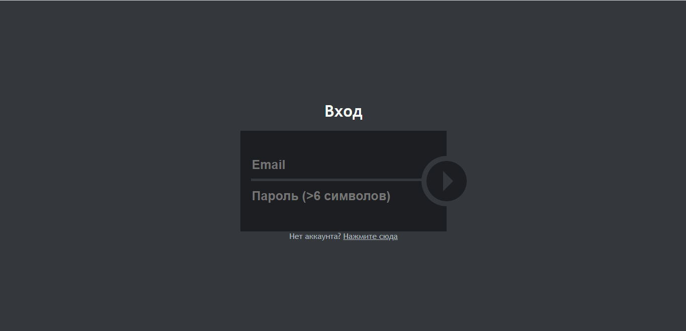
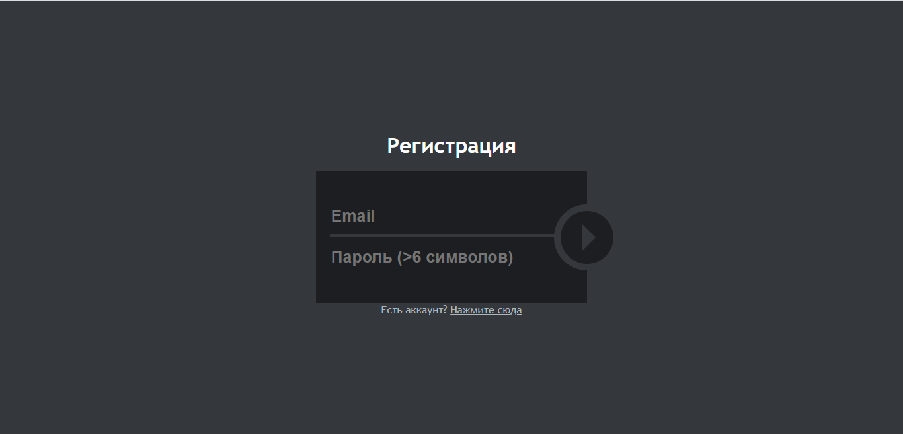
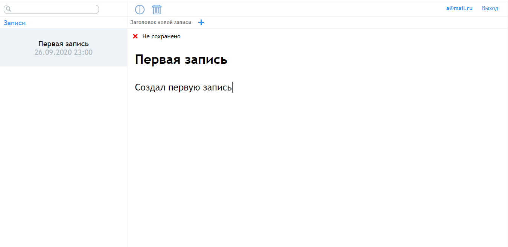
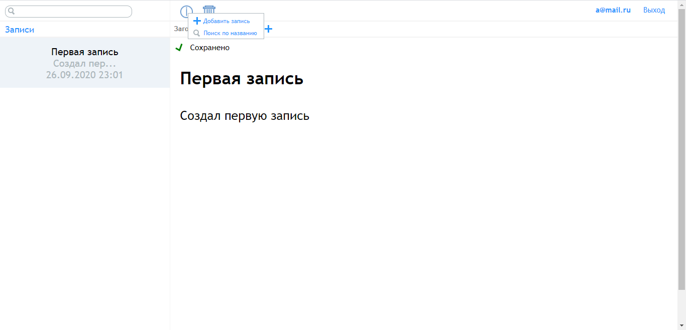
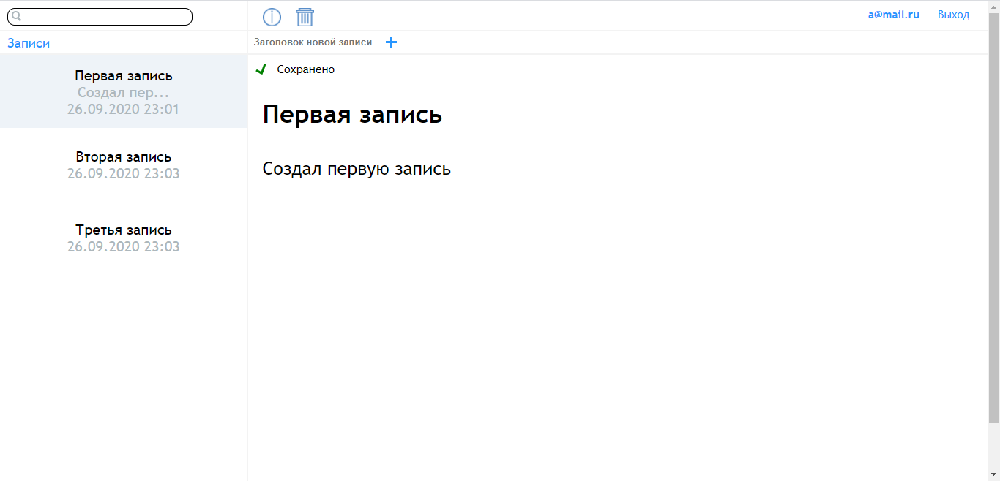
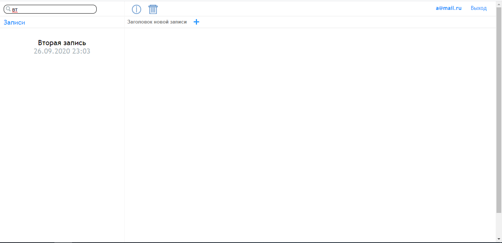

# Note-taking-app
Позволяет создавать, сохранять и редактировать записи. Все данные(пользователи и записи) хранятся в firebase RealTime Database. Приложение собрано с помощью webpack. При создании приложения использовался React js, препроцессор Sass

## Форма входа

## Форма регистрации

## Первая запись

## Сохранил изменения в записи

## Добавил еще записи

## Поиск по названию
